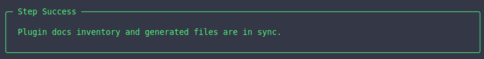
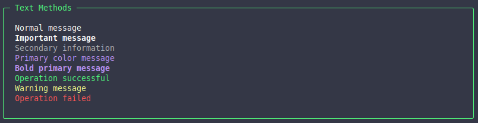
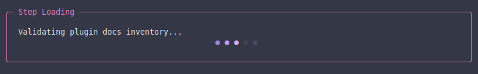
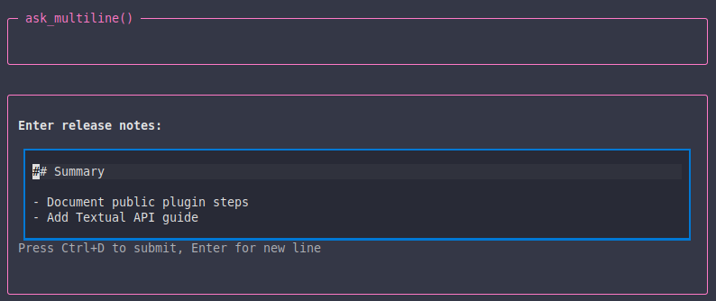
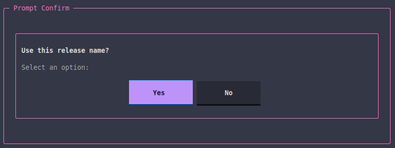
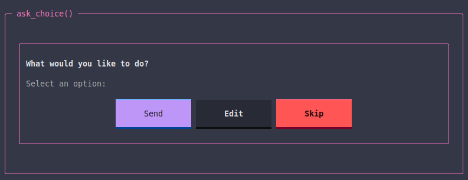
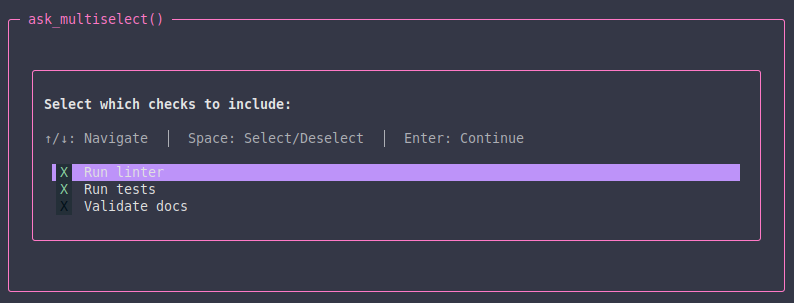
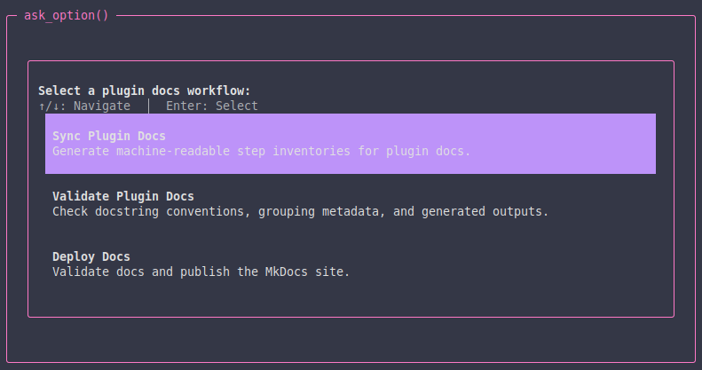
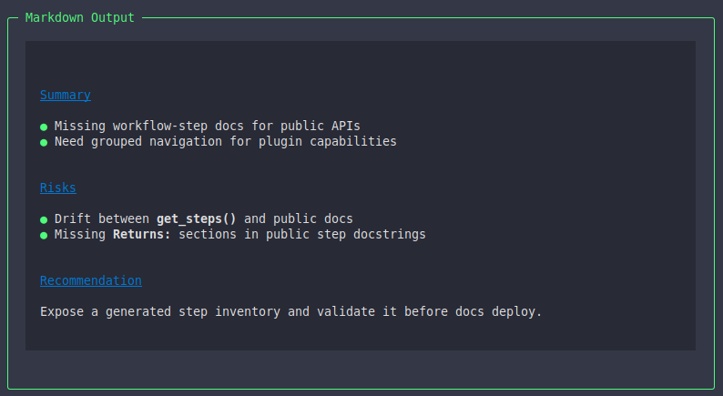
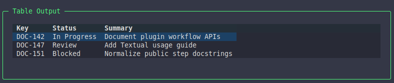

# Textual in Steps

`ctx.textual` is the public TUI API available inside workflow steps.

Use it when you want your custom step to look and behave like the rest of Titan: consistent headings, status output, prompts, markdown, tables, and loading indicators.



## When to use `ctx.textual`

Use `ctx.textual` when your step needs to:

- show progress or rich output
- display structured information such as markdown, panels, or tables
- ask the user for input
- keep the visual style aligned with Titan's built-in steps

If your step is just a simple shell command with no interaction, a command step may be enough.

## Basic pattern

```python
from titan_cli.engine import WorkflowContext, WorkflowResult, Success, Error


def my_step(ctx: WorkflowContext) -> WorkflowResult:
    if not ctx.textual:
        return Error("Textual UI context is not available for this step.")

    ctx.textual.begin_step("My Step")

    value = ctx.get("some_key")
    if not value:
        ctx.textual.end_step("error")
        return Error("Missing some_key")

    with ctx.textual.loading("Processing..."):
        result = value.upper()

    ctx.textual.success_text("Done")
    ctx.textual.end_step("success")
    return Success("Step completed", metadata={"result": result})
```

## Step lifecycle methods

### `begin_step(title)`

Starts the visual step block.

```python
ctx.textual.begin_step("Fetch Pull Request")
```

### `end_step(status)`

Closes the step block visually.

```python
ctx.textual.end_step("success")
ctx.textual.end_step("error")
ctx.textual.end_step("skip")
```

This visual status is related to, but separate from, the `WorkflowResult` you return.

## Text output methods

Use these methods instead of inventing your own ad-hoc formatting.

```python
ctx.textual.text("Normal message")
ctx.textual.bold_text("Important message")
ctx.textual.dim_text("Secondary information")
ctx.textual.primary_text("Primary color message")
ctx.textual.bold_primary_text("Bold primary message")
ctx.textual.success_text("Operation successful")
ctx.textual.warning_text("Warning message")
ctx.textual.error_text("Operation failed")
```

Recommended rule: prefer these dedicated methods over manual Rich/Textual markup so your step stays visually consistent with Titan.



## Loading indicators

Use `loading()` for operations that may take noticeable time.

```python
with ctx.textual.loading("Fetching issue data..."):
    result = ctx.jira.get_issue("APP-123")
```



## Markdown output

Use `markdown()` when you want Titan to render long-form structured content.

```python
ctx.textual.markdown("## Summary\n\n- Point 1\n- Point 2")
```

This is especially useful for AI-generated content, issue summaries, and review output.

## Mounting widgets

Use `mount()` when you want to render a Textual/Titan widget directly.

```python
from titan_cli.ui.tui.widgets import Panel

ctx.textual.mount(
    Panel(text="Operation completed", panel_type="success")
)
```

Common use cases:

- panels for highlighted messages
- tables for tabular data
- richer widgets exposed by Titan's TUI layer

## Input methods

`ctx.textual` also gives you a consistent input API.

### `ask_text()`

Use this when the user needs to provide a single-line value such as a title, branch name, or identifier.

```python
title = ctx.textual.ask_text("Enter PR title:")
```


### `ask_multiline()`

Use this when the user needs to enter longer free-form content such as a description, release notes, or a review comment.

```python
body = ctx.textual.ask_multiline("Enter PR body:", default="")
```



### `ask_confirm()`

Use this when the user only needs to answer yes or no.

```python
confirmed = ctx.textual.ask_confirm("Continue?", default=True)
```



### `ask_choice()`

Use this when the user must pick one option.

```python
from titan_cli.ui.tui.widgets import ChoiceOption

choice = ctx.textual.ask_choice(
    "What would you like to do?",
    options=[
        ChoiceOption(value="send", label="Send", variant="primary"),
        ChoiceOption(value="edit", label="Edit", variant="default"),
        ChoiceOption(value="skip", label="Skip", variant="error"),
    ],
)
```



### `ask_multiselect()`

Use this when the user may choose multiple items.

```python
from titan_cli.ui.tui.widgets import SelectionOption

selected = ctx.textual.ask_multiselect(
    "Select which checks to include:",
    [
        SelectionOption(value="lint", label="Run linter", selected=True),
        SelectionOption(value="tests", label="Run tests", selected=True),
        SelectionOption(value="docs", label="Validate docs", selected=False),
    ],
)
```



### `ask_option()`

Use this for styled option lists when you want more structured selection UI.

```python
from titan_cli.ui.tui.widgets import OptionItem

selected = ctx.textual.ask_option(
    "Select a plugin docs workflow:",
    [
        OptionItem(
            value="sync-plugin-docs",
            title="Sync Plugin Docs",
            description="Generate machine-readable step inventories for plugin docs.",
        ),
        OptionItem(
            value="validate-plugin-docs",
            title="Validate Plugin Docs",
            description="Check docstring conventions, grouping metadata, and generated outputs.",
        ),
    ],
)
```



## `ctx.textual` and workflow results

The visual step status and the returned workflow result are related but not identical.

Typical pairing:

- `Success(...)` -> `end_step("success")`
- `Error(...)` -> `end_step("error")`
- `Skip(...)` -> `end_step("skip")`
- `Exit(...)` -> usually `end_step("success")` or `end_step("skip")`, depending on context

If the step is stopping the whole workflow early, that is controlled by `Exit`, not by `end_step()`.

## Example: simple interactive step

```python
from titan_cli.engine import WorkflowContext, WorkflowResult, Success, Error


def ask_release_name(ctx: WorkflowContext) -> WorkflowResult:
    if not ctx.textual:
        return Error("Textual UI context is not available for this step.")

    ctx.textual.begin_step("Release Name")

    try:
        name = ctx.textual.ask_text("Enter release name:")
    except (KeyboardInterrupt, EOFError):
        ctx.textual.end_step("error")
        return Error("User cancelled")

    if not name:
        ctx.textual.end_step("error")
        return Error("Release name is required")

    ctx.textual.success_text(f"Using release name: {name}")
    ctx.textual.end_step("success")
    return Success("Release name captured", metadata={"release_name": name})
```

## Example: display structured output

```python
from titan_cli.engine import WorkflowContext, WorkflowResult, Success, Error
from titan_cli.ui.tui.widgets import Panel


def show_summary(ctx: WorkflowContext) -> WorkflowResult:
    if not ctx.textual:
        return Error("Textual UI context is not available for this step.")

    ctx.textual.begin_step("Summary")
    ctx.textual.mount(Panel(text="Everything looks good", panel_type="success"))
    ctx.textual.end_step("success")
    return Success("Summary shown")
```





## Good defaults

When in doubt:

- use `begin_step()` and `end_step()`
- use dedicated text methods like `success_text()` and `error_text()`
- use `loading()` around long operations
- use `markdown()` for long-form structured text
- use `mount()` for tables or panels

## What to read next

- [Workflow Steps](workflow-steps.md)
- [Workflows](workflows.md)
- [Your First Workflow](../getting-started/your-first-workflow.md)
