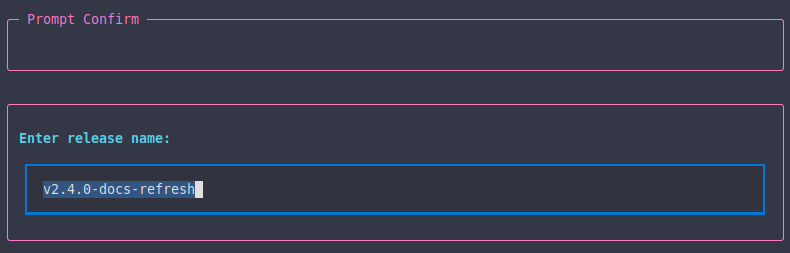

# Your First Textual Step

In this tutorial you'll build a small project step that uses Titan's `ctx.textual` API so it looks consistent with built-in workflows.

You will learn how to:

- write a project step in `.titan/steps/`
- use `ctx.textual.begin_step()` and `end_step()`
- ask the user for input and return metadata to later steps

## The scenario

You want a small workflow that asks for a release name and saves it into workflow context so another step can use it later.



## Step 1 - Create the step file

Create `.titan/steps/ask_release_name.py`:

```python
from titan_cli.engine import WorkflowContext, WorkflowResult, Success, Error


def ask_release_name(ctx: WorkflowContext) -> WorkflowResult:
    if not ctx.textual:
        return Error("Textual UI context is not available for this step.")

    ctx.textual.begin_step("Release Name")

    try:
        name = ctx.textual.ask_text("Enter release name:")
    except (KeyboardInterrupt, EOFError):
        ctx.textual.end_step("error")
        return Error("User cancelled")

    if not name:
        ctx.textual.end_step("error")
        return Error("Release name is required")

    ctx.textual.success_text(f"Using release name: {name}")
    ctx.textual.end_step("success")
    return Success("Release name captured", metadata={"release_name": name})
```

Things to notice:

- the function name `ask_release_name` must match the YAML `step:` value exactly
- `begin_step()` and `end_step()` make the output look like Titan's built-in steps
- `ask_text()` gives you a consistent prompt UI
- `metadata` saves `release_name` for later steps

## Step 2 - Create a workflow

Create `.titan/workflows/release-name-demo.yaml`:

```yaml
name: "Release Name Demo"
description: "Ask for a release name and show it"

steps:
  - id: ask-release-name
    name: "Ask Release Name"
    plugin: project
    step: ask_release_name

  - id: show-release-name
    name: "Show Release Name"
    command: "printf 'Release: %s\n' '${release_name}'"
    params:
      release_name: "${release_name}"
```

This workflow:

- runs your project step first
- stores `release_name` in workflow context
- uses that value in a later step

## Step 3 - Run it

Launch Titan and run the new workflow from the menu.

You should see:

- a step header for `Release Name`
- a Textual prompt asking for the release name
- a success message once the value is captured

## What to read next

- [Workflow Steps](../concepts/workflow-steps.md)
- [Textual in Steps](../concepts/textual-steps.md)
- [Workflows](../concepts/workflows.md)
